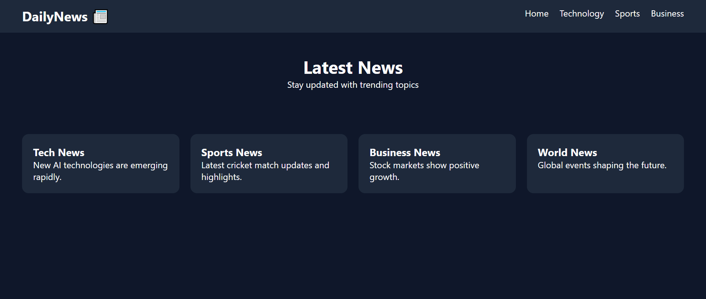

# 📰 News Website UI - Day 1 Project 11

## 📌 Project Overview

This project is a modern **News Website UI** created as part of my semester challenge to build 200 websites.

It represents a simple news portal layout with categories and multiple news cards.

---

## 🎯 Features

* 📰 Navigation Bar with Categories
* 🧾 News Cards Section
* 📂 Multiple News Categories (Tech, Sports, Business, World)
* 📱 Responsive Grid Layout
* 🎨 Clean and Modern UI

---

## 🛠️ Technologies Used

* HTML5
* CSS3 (Grid + Flexbox)

---

## 📂 Project Structure

```
site-11-news-website/
│
├── index.html
├── style.css
├── preview.png
└── README.md
```

---

## 📸 Preview

> ⚠️ Make sure `preview.png` is uploaded in the same folder



---

## 💡 Learning Outcome

* Learned multi-section website layout
* Practiced grid-based UI design
* Built navigation bar with categories
* Improved UI/UX design skills
* Strengthened Git & GitHub workflow

---

## 🔥 Author

**Yash Patil**
Future Data Engineer 🚀

---

## ⭐ Note

This project is part of my goal to build **200 websites** to improve my web development and design skills.
